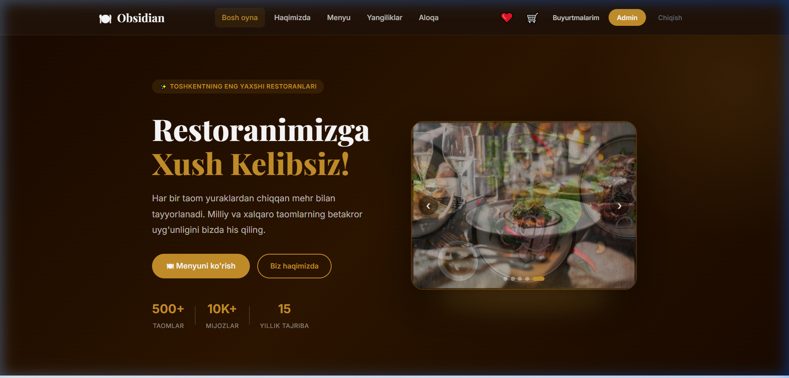
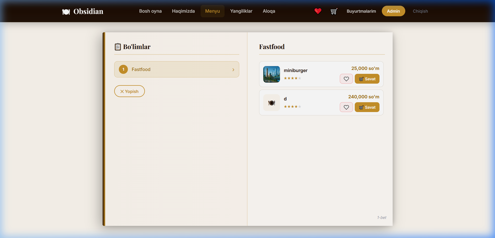
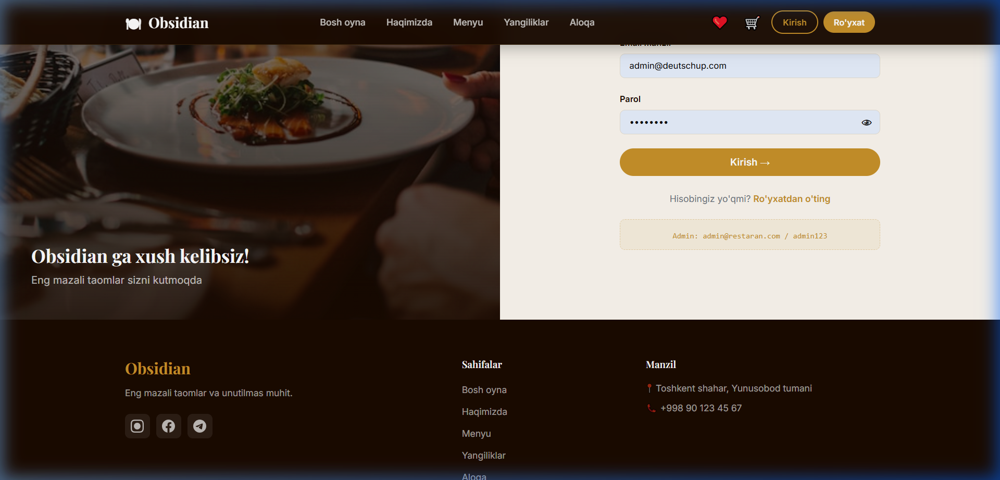

# Obsidian — Premium Restoran Boshqaruv Tizimi

**Obsidian** — bu zamonaviy dizayn, interaktiv imkoniyatlar va qulay boshqaruv paneliga ega bo'lgan premium darajadagi restoran boshqaruv tizimi (SaaS/Veb ilova). Loyiha mijozlar uchun chiroyli interfeys hamda administratorlar uchun restoranning barcha jarayonlarini to'liq boshqarish imkonini beruvchi admin panelni o'z ichiga oladi.

Loyiha ikki asosiy qismdan iborat:
1. **Frontend**: Vue 3 va Vite yordamida yozilgan SPA (Single Page Application).
2. **Backend**: Spring Boot (Java 17) va PostgreSQL bazasida qurilgan xavfsiz REST API.

---

## 📸 Skrinshotlar

### 1. Bosh Sahifa (Landing Page)
Premium qorong'i dizayn (dark mode), animatsiyalar va zamonaviy tipografika uyg'unligi.


### 2. Interaktiv Menyu (Book-Style Menu)
Mijozlar uchun kitob shaklidagi interaktiv menyu sahifasi. Sahifalarni varaqlash orqali toifalar va taomlarni tanlash mumkin.


### 3. Tizimga Kirish (Authentication)
Xavfsiz va chiroyli dizayndagi login oynasi. Administrator va mijozlar uchun moslashuvchan tizim.


---

## 🛠 Texnologiyalar Steki

### Frontend:
*   **Vue 3 (Composition API)** — tezkor va moslashuvchan reaktiv UI.
*   **Vite** — zamonaviy va o'ta tezkor frontend yig'uvchi (build tool).
*   **Tailwind CSS** — stilizatsiya va chiroyli premium dizayn uchun.
*   **Pinia** — holatni boshqarish (State Management), masalan: Savatcha va Saqlangan taomlar do'koni.
*   **Vue Router** — sahifalararo marshrutizatsiya va admin panel yo'llarini himoyalash.
*   **Lucide Vue** — zamonaviy va chiroyli piktogrammalar (icons).
*   **Leaflet** — yetkazib berish manzilini xaritada tanlash imkoniyati.

### Backend:
*   **Java 17 & Spring Boot 3** — mustahkam va kengayuvchan backend arxitekturasi.
*   **Spring Security & JWT (JSON Web Token)** — foydalanuvchilar xavfsizligi va seanslarni boshqarish.
*   **Spring Data JPA & Hibernate** — ma'lumotlar bazasi bilan ishlashni osonlashtiruvchi ORM.
*   **PostgreSQL** — ma'lumotlarni ishonchli saqlash uchun relational ma'lumotlar bazasi.
*   **Telegram Bot API Integration** — buyurtmalar va zallar haqidagi ma'lumotlarni to'g'ridan-to'g'ri administratorning Telegram botiga yuborish.

---

## 🚀 Loyihani Ishga Tushirish

### 1. Talablar (Prerequisites)
*   **Java JDK 17** yoki undan yuqori
*   **Node.js** (v18 yoki undan yuqori) va **npm**
*   **PostgreSQL** ma'lumotlar bazasi

---

### 2. Backend-ni Sozlash va Ishga Tushirish

1. PostgreSQL-da `restarandb` nomli ma'lumotlar bazasini yarating.
2. `backend/src/main/resources/application.properties` faylini ochib, o'z ma'lumotlar bazangiz ma'lumotlarini (username, password) kiriting:
    ```properties
    spring.datasource.url=jdbc:postgresql://localhost:5432/restarandb
    spring.datasource.username=postgres
    spring.datasource.password=YOUR_DATABASE_PASSWORD
    ```
3. Telegram bot integratsiyasini yoqish uchun mos tokenlarni kiriting:
    ```properties
    telegram.bot.dining.token=YOUR_TELEGRAM_DINING_BOT_TOKEN
    telegram.bot.delivery.token=YOUR_TELEGRAM_DELIVERY_BOT_TOKEN
    telegram.admin.chatId=YOUR_TELEGRAM_ADMIN_CHAT_ID
    ```
4. Backend loyihasini ishga tushirish uchun backend papkasiga o'ting va quyidagi buyruqni bajaring:
    ```bash
    mvn spring-boot:run
    ```
   *Backend sukut bo'yicha **`http://localhost:8080`** portida ishga tushadi.*

---

### 3. Frontend-ni Sozlash va Ishga Tushirish

1. `frontend` papkasiga o'ting:
2. Barcha kerakli paketlarni o'rnating:
    ```bash
    npm install
    ```
3. Loyihani ishlab chiqish rejimida (development mode) ishga tushiring:
    ```bash
    npm run dev
    ```
   *Frontend sukut bo'yicha **`http://localhost:5173`** portida ishga tushadi.*

---

        
